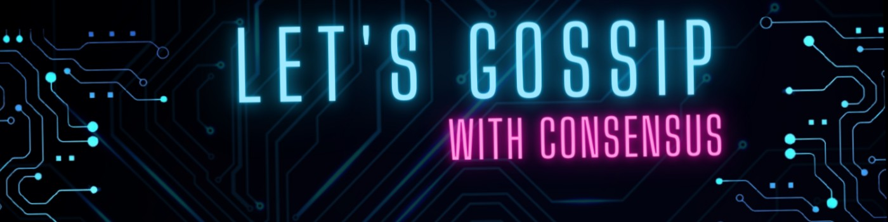

   
&nbsp;

 👋 👋  **Hi !   I am Laurent , remote-first French Golang developer (former NodeJS backend coder) living near the charming city of Versailles** .  
  
  
 👀 **My main professional interests & endeavours are in the field of  coding distributed systems with a gRPC architecture and**  
  **use CNCF tools to monitor those . I also like to work with open-source  Key-Value stores such as LevelDB and its more feature-rich improvement : RocksDB** . 
  
 

👨 👩 **My peers say that I have  currently a confirmed Golang level & currently honing my skills to soon take an  
exam to become a  'Prometheus Certified Associate'** .
 
&nbsp;  
🌱 **My stack of choice: microservices + gRPC + 'Prometheus-Grafana-Jaeger' trifecta + KV storage engines**.    
**✍🏻**  -> &nbsp; [knauss.dev](https://knauss.dev)  &nbsp; &nbsp;  &nbsp;    📭 -> ***`laurentknauss@protonmail.com`.***  

  &nbsp; &nbsp;   
&nbsp;

          

&nbsp;

🚲 &nbsp;  🎧 &nbsp;  **When not working, I like to mountain bike , listen to great podcasts : JRE, HubermanLab, Lex Fridman,  
and take care of those close to my heart.**  
&nbsp;
&nbsp;

