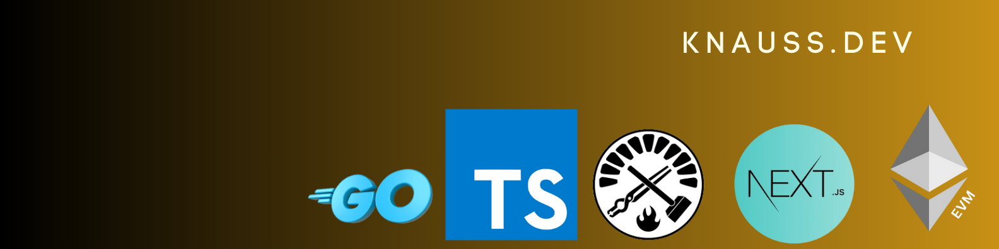

   
&nbsp;

 **👋 👋**  **Hi !   I am Laurent , remote-first French blockchain developer living near the charming city of Versailles** .  
  
  
 👀 **My main professional interests & endeavours are in the field of  coding distributed systems & p2p networks**  
  
  
 

👨 👩 **My peers say that I have  currently a experienced Nodejs - Golang - Solidity level** .
 
&nbsp;  
🌱 
 

  &nbsp; &nbsp;   
&nbsp;

          

**✍🏻**  -> &nbsp; [knauss.dev](https://knauss.dev)  &nbsp; &nbsp;  &nbsp;  

**📭** -> ***`laurentknauss@protonmail.com`.***  
&nbsp;

&nbsp;

🚲 &nbsp;  🎧 &nbsp;  **When not working, I like to mountain bike , listen to great podcasts : JRE, HubermanLab, Lex Fridman,  
and take care of those close to my heart.**  
&nbsp;
&nbsp;

